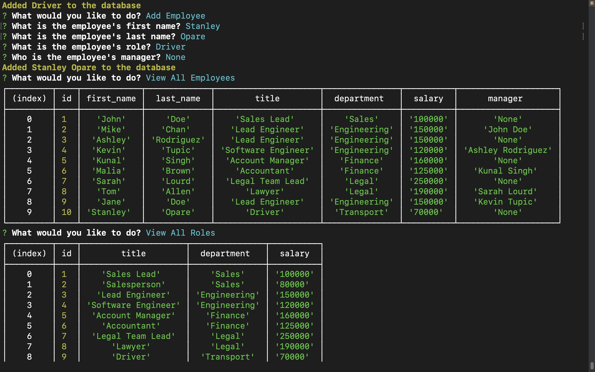

  # Employee Tracker Using SQL

  ## Description
  Companies are everywhere and new ones spring up everyday. Keeping track of all employees, their roles and salary can be a daunting task and can be very time consuming especially for large companies. The chances of losing track is very high. To further complicate issues there are more non-developers out there. To circumvent this issue, this project is designed to help non-developers answer some onscreen interactive questions at the front end while at the backend the database gets updated and displayed to the user. This saves time and effort on the part of the user. The user story and acceptance ccriteria is below. The packages used are [Inquirer](https://www.npmjs.com/package/inquirer) and [MySQL2](https://dev.mysql.com/doc/). The application is run using [NodeJS](https://nodejs.org/en)
  
  ## Table of Contents
  - [User Story](#UserStory)
  - [Acceptance Criteria](#AcceptanceCriteria)
  - [Usage](#Usage)
  - [Appearance and Functionality](#Appearance&Functionality)
  - [Questions](#questions)
  - [Credits](#Credits)
  
  ## User Story
  ```
  AS A business owner
  I WANT to be able to view and manage the departments, roles, and employees in my company
  SO THAT I can organize and plan my business
  ```

  ## Acceptance Criteria
  ```
  GIVEN a command-line application that accepts user input
  WHEN I start the application
  THEN I am presented with the following options: view all departments, view all roles, view all employees, add a department, add a role, add an employee, and update an employee role
  WHEN I choose to view all departments
  THEN I am presented with a formatted table showing department names and department ids
  WHEN I choose to view all roles
  THEN I am presented with the job title, role id, the department that role belongs to, and the salary for that role
  WHEN I choose to view all employees
  THEN I am presented with a formatted table showing employee data, including employee ids, first names, last names, job titles, departments, salaries, and managers that the employees report to
  WHEN I choose to add a department
  THEN I am prompted to enter the name of the department and that department is added to the database
  WHEN I choose to add a role
  THEN I am prompted to enter the name, salary, and department for the role and that role is added to the database
  WHEN I choose to add an employee
  THEN I am prompted to enter the employee’s first name, last name, role, and manager, and that employee is added to the database
  WHEN I choose to update an employee role
  THEN I am prompted to select an employee to update and their new role and this information is updated in the database 
  ```

  ## Usage
  Run the application using the following command:
  ```sh
  node index.js
  ```

  ## Appearance and Functionality 
  Click on [Employee Tracker Video](https://watch.screencastify.com/v/swZMhFYMoe8u69WMOeNP) to watch the video walkthrough.

  

  ## Questions
  For any questions or suggestions, feel free to reach out to me on GitHub: [StanOp09](https://github.com/StanOp09) or via email: stanleykaopare@gmail.com.

  ## Credits
  - Sean Roshan
  - [NPM](https://www.npmjs.com/)
  - [NodeJS](https://nodejs.org/en)
  - [Inquirer](https://www.npmjs.com/package/inquirer)
  - [MySQL2](https://dev.mysql.com/doc/)
